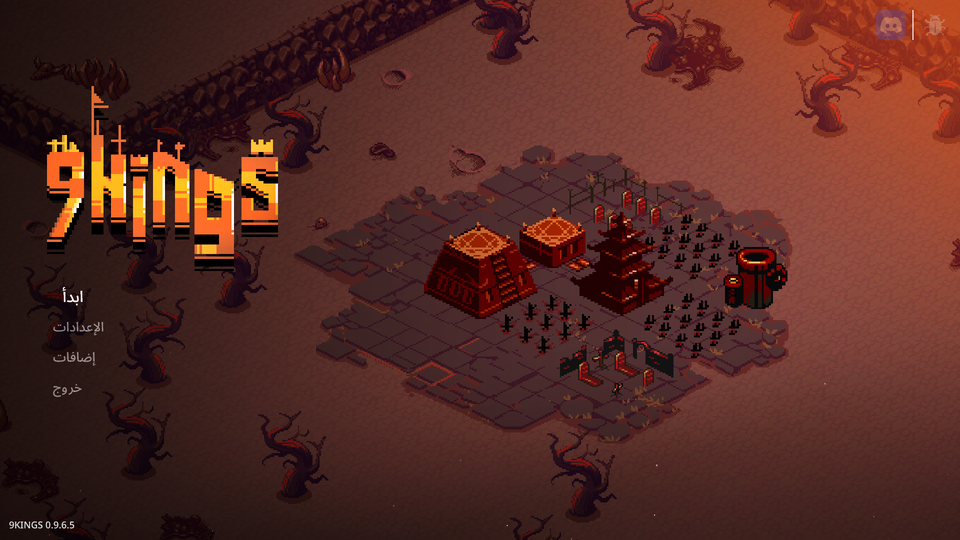
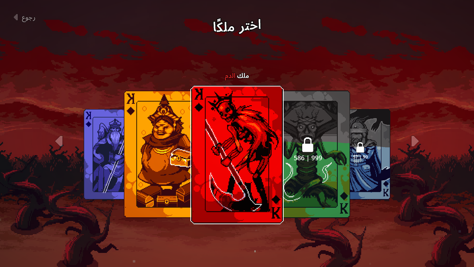
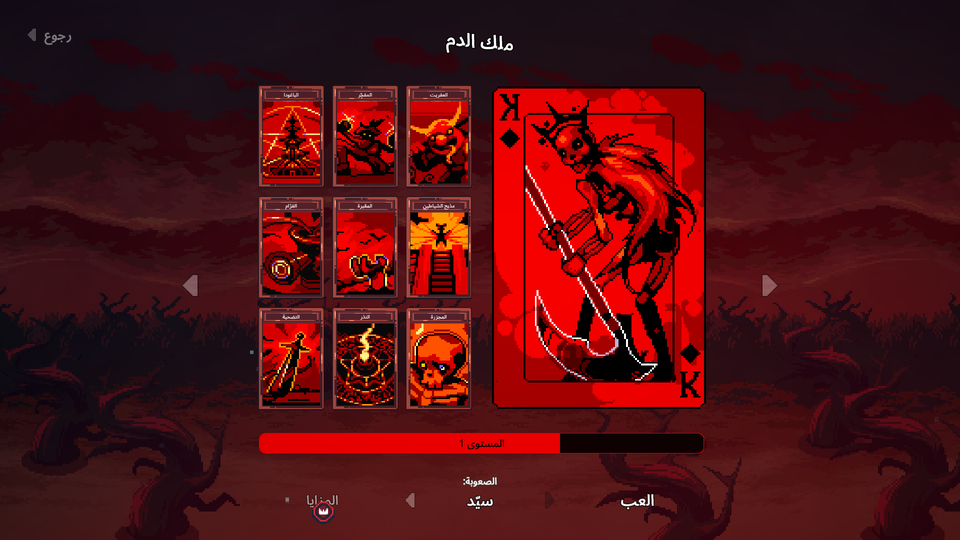
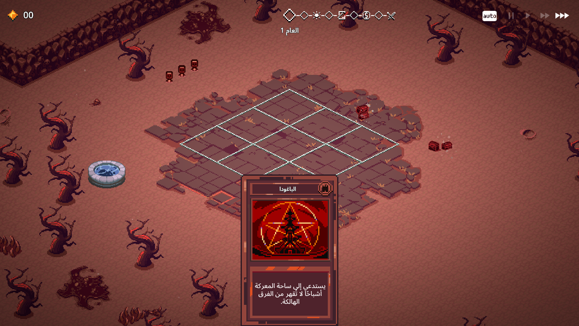

<div dir="rtl">

# ‏9 Kings‎ بالعربية

تعريب كامل للعبة [‏9 Kings‎](https://store.steampowered.com/app/2784470/9_Kings/).
يُركَّب بمثبّت، ويحتفظ بنسخة احتياطية من الملف الأصلي، فالإزالة تُعيد اللعبة إلى الإنجليزية
تمامًا كما كانت.

</div>









<div dir="rtl">

## التنزيل

نزّل المثبّت من صفحة **[الإصدارات](../../releases)**:

- ويندوز: `9Kings-Arabic-Windows.exe`
- لينكس: `9Kings-Arabic-Linux`

## التثبيت على ويندوز

أغلق اللعبة، ثم انقر نقرًا مزدوجًا على `9Kings-Arabic-Windows.exe`.

يبحث المثبّت عن اللعبة وحده في مكتبات Steam؛ اضغط **Install**. وإن لم يجدها، اكتب مسار مجلد
اللعبة أو اسحبه إلى النافذة (في Steam: زر الفأرة الأيمن على 9 Kings ← إدارة ← تصفّح الملفات المحلية).

إن ظهرت رسالة عن الصلاحيات، اضغط على الملف بزر الفأرة الأيمن واختر **تشغيل كمسؤول**.

## التثبيت على لينكس

</div>

```bash
chmod +x 9Kings-Arabic-Linux && ./9Kings-Arabic-Linux
```

<div dir="rtl">

## تشغيل التعريب

شغّل اللعبة ← الإعدادات ← اللغة ← اختر **Arabic**.

## الإزالة

شغّل المثبّت نفسه واختر **Uninstall**، فيُعيد الملف الأصلي من النسخة الاحتياطية بعد التحقق منها.
ويمكنك دائمًا استعادة اللعبة من Steam: خصائص ← الملفات المثبّتة ← التحقق من سلامة ملفات اللعبة.

## ما ينبغي معرفته

- **المثبّت لا يحمل أي ملف من ملفات اللعبة.** بل يعدّل نسختك أنت، ويحتفظ بنسخة احتياطية من
  الملف الأصلي قبل أن يمسّه.
- المترجَم **1,985** نصًّا من **1,991**. والستة الباقية صيغ أرقام لا تُترجَم.
- اعتمدت الترجمة على قراءة نصوص اللعبة كاملة وفهم سياقها لا على الترجمة الحرفية،
  والمصطلحات موثّقة في [docs/glossary.md](docs/glossary.md).
- النسخة المدعومة من اللعبة: **0.9.6.5** (بناء Steam رقم 25462185). إن حُدِّثت اللعبة فلن يعدّل
  المثبّت شيئًا، وسيطلب منك انتظار إصدار جديد من التعريب.

## وجدت خطأً؟

افتح [مشكلة](../../issues) واذكر النص كما ظهر وأين رأيته في اللعبة، وأرفق صورة إن أمكن.
وإن ظهر سطر قبل السطر الذي يسبقه داخل صندوق ما، فتلك لوحة لم تُقَس بعد؛ اذكر اسم اللوحة.

## الخطوط والتراخيص

الخط المستخدم [Noto Sans Arabic](https://github.com/notofonts/arabic) مدموجًا مع خط اللعبة
نفسه، برخصة [SIL Open Font License 1.1](fonts/OFL.txt).

شيفرة المشروع برخصة MIT. هذا عمل غير رسمي من المعجبين، ولا صلة له بمطوّري اللعبة
(‏9 Kings‎ © Sad Socket)، ولا يحتوي على أي ملف من ملفاتها.

## للمساهمين

شرح آلية العمل وبنية المشروع في [docs/internals.md](docs/internals.md)، ومنهج الترجمة
في [docs/METHOD.md](docs/METHOD.md)، ودليل المصطلحات في [docs/glossary.md](docs/glossary.md).

</div>
